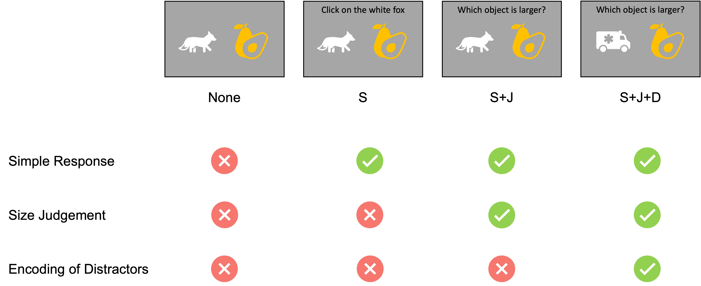
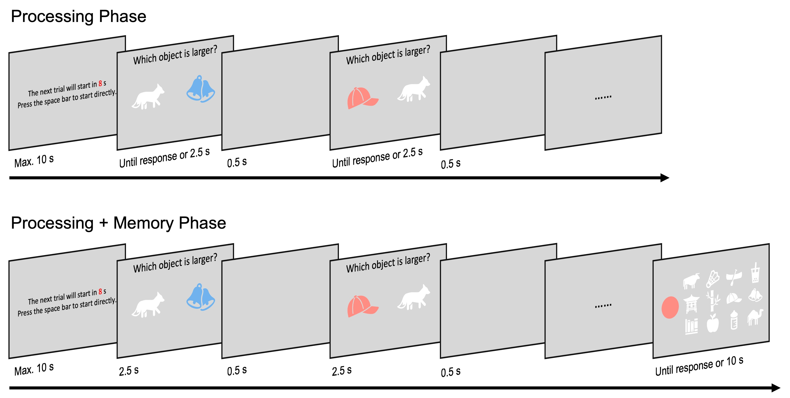

## Introduction

hello, how are you?

## Introduction

## The present study

## Experiment 1 -- Design

::: {style="margin-top: 3em;"}
{width="80%"}
:::

## Experiment 1 -- Procedure

{width="88%"}
